# IPF target prioritisation — integrated analysis

**Disease**: idiopathic pulmonary fibrosis (IPF; EFO_0000768)
**Sources**: Open Targets Platform 26.03 · GSE150910 bulk RNA-seq (n=206) · GSE135893 single-cell (n=114k annotated) · PubMed · OpenFDA AERS
**Branch**: `analysis/ipf-target-prioritisation`

**What this report contains**: 12 phases (A–L) of analysis stacking genetic → druggability → bulk transcriptomics → single-cell → bulk-deconvolution → pseudobulk → toxicity evidence to prioritise novel IPF targets. Top-5 picks (MUC5B / SFTPA2 / DSP / TERT / MUC5AC) robust across 16 weight perturbations. Headline finding: OT correctly surfaces the disease axis but the obvious drug-target match for TERT (imetelstat) is mechanistically backwards — and the right class (telomerase activators / androgens like danazol) fails on tolerability per black-box-warning + AERS evidence we now document empirically.

## TL;DR — top picks (composite v2)

Composite v2 adds a transcriptomic axis (bulk DE in IPF lung) on top of v1's genetic + druggability + mouse-phenotype axes. Top-5 picks are **identical across 16 weight perturbations** (genetic_w ∈ {0.20…0.50} × tx_w ∈ {0.10…0.40}; see figure J2):

| Rank | Target | Stratum | Composite v1 → v2 | TL;DR |
|-----:|--------|---------|------------------:|-------|
| 1 | **MUC5B** | C: novel | 0.444 → **0.606** (+157% rank) | Dominant IPF GWAS hit (rs35705950, OR ~7 hets / ~21 hom; Seibold 2011 NEJM); +3.46 LFC bulk; ectopic distal expression in IPF SCGB3A2+ and transitional/basaloid epithelium. Hard direct drug target — angle is upstream cell-state regulation (ATF4/ER-stress per Conlon 2023). |
| 2 | **MUC5AC** | B: repurpose | 0.378 → **0.547** | Co-regulated mucin, +3.25 LFC. Less GWAS-validated than MUC5B but transcriptomic signal is co-equal. |
| 3 | **TERT / telomere axis** | B/C mixed | 0.561 → **0.517** | Strong genetics (TERT/PARN/RTEL1 in top-9). **Imetelstat (TERT inhibitor) is mechanistically backwards.** Right class is *telomerase activators*; danazol fails on tolerability (ANDROTELO 2026 NCT03710356; Eppinga 2023 50-pt cohort independently confirms 56% AE discontinuation). Open opportunity for next-generation activators with a cleaner therapeutic index. |
| 4 | **SFTPA2** | C: novel | 0.511 → **0.480** | Familial-IPF surfactant gene; bulk −0.90 LFC driven by *proliferating epithelial pool* losing surfactant, not by terminally differentiated AT2. Cell-state intervention, not enzyme replacement. |
| 5 | **DSP** | C: novel | 0.482 → **0.472** | GWAS L2G 0.94 (Fingerlin 2013), +1.06 LFC bulk. **Borie 2022 shows the IPF risk allele *increases* DSP lung expression** — therapeutic hypothesis is to *reduce* DSP / disrupt aberrant epithelial reinforcement, not augment it. Single-cell shows the bulk increase is *cell-composition driven* (more MUC5B+/lymphatic/basal cells in IPF). Caveat: DSP is a 332-kDa intracellular plakin scaffold with no enzymatic activity; OT's `hasPocket=1` flag is exploratory. |

Stratum legend: **A** = drug already approved / late-stage trial for IPF; **B** = drug exists for another indication (repurposing); **C** = novel/undrugged.

## Headline finding — naïve drug-repurposing scores can suggest mechanistically wrong drugs

OT correctly surfaces the telomere axis (TERT/PARN/RTEL1) as the dominant genetic driver of ~10% of IPF cases. The naïve drug-target match for TERT (imetelstat) is the FDA-approved telomerase inhibitor — but IPF is *loss-of-function* of telomerase, so an inhibitor would worsen disease. Direct mouse evidence: imetelstat counters the protective effect of a telomerase activator in bleomycin lung fibrosis ([Le Saux 2013, *PLoS One*](https://doi.org/10.1371/journal.pone.0058423), PMID 23516479).

The right class is **telomerase activators**, but the most-studied real-world option (danazol, an androgen-receptor agonist that upregulates TERT) **fails on tolerability**:

- [Townsley 2016, *NEJM*](https://doi.org/10.1056/NEJMoa1515319) (PMID 27192671): in 27 telomere-disease patients, danazol elongated telomeres (mean +386 bp at 24 mo) and produced 79–83% hematological response.
- [Sicre de Fontbrune 2026, *ERJ Open Res*](https://doi.org/10.1183/23120541.00905-2025) (PMID 41953763): ANDROTELO Phase 2 (NCT03710356), 30 patients with TRG-mutation PF/BMF, 12-month danazol → **42% completion rate, 9/24 PF (38%) discontinued for adverse effects**, median FVC change −10%; "danazol was poorly tolerated... thus precluding efficacy assessment."
- [Eppinga 2023, *ERJ Open Res*](https://doi.org/10.1183/23120541.00131-2023) (PMID 37753281): independent 50-patient off-label danazol IPF cohort: **no FVC benefit (p=0.46), 56% discontinuation for AEs**. Second independent confirmation that tolerability is the rate-limiter for the entire androgen drug class in IPF.
- Short telomeres predict accelerated FVC/DLCO decline in IPF ([Wuyts 2025, *Lung*](https://doi.org/10.1007/s00408-025-00830-6), PMID 39884762; 2026 meta-analysis pooled SMD −0.84, PMID 41728098). The *patient stratification* logic for telomere-targeted therapy is solid.

**Open opportunity**: better-tolerated telomerase activators / TERT-axis modulators. No clinically advanced non-androgen telomerase activator is currently indexed (TERT-PROTACs target oncology, opposite direction).

This finding generalises to a broader caution about automated drug-repurposing systems: high target-association score does not imply the available drug acts in the right direction. **Directionality matters and currently is not encoded in OT's `known_drug` evidence type.**

## Methodology — what each phase does and why

This analysis stacks five independent evidence layers (genetics → druggability → bulk transcriptomics → cell-type-resolved expression → cell-type-resolved DE) and tests them against pharmacovigilance data. Each phase answers a specific question that the prior phases can't.

### Phases A–F — Open Targets composite ranking

**What we did.** Queried OT 26.03 parquet release via DuckDB. For each disease-target pair we pulled the rolled-up association score plus per-datasource and per-datatype breakdowns (genetic_association, genetic_literature, animal_model, known_drug, literature, rna_expression). We added druggability features from `target_prioritisation` (hasPocket, hasLigand, hasSmallMoleculeBinder, hasHighQualityChemicalProbes), mouse-phenotype overlap with respiratory/fibrosis terms, and target-level safety (hasSafetyEvent, geneticConstraint).

**Why.** OT is the largest curated target-disease evidence aggregator in life sciences. Its association score is well-validated for ranking. The challenge is that its `known_drug` evidence type is **circular** for any disease that already has drugs — those drugs populate the score for their targets, biasing toward already-known biology. We deliberately excluded `known_drug` from our composite to surface novel candidates.

**Composite v1**:
```
v1 = 0.40·max(genetic_assoc, genetic_lit) + 0.20·druggability_index
   + 0.20·mouse_phenotype + 0.10·literature + 0.10·biology − 0.10·hasSafetyEvent

druggability_index = mean(hasPocket, hasLigand, hasSMB, hasHighQualityChemicalProbes)
mouse_phenotype = min(n_lung_relevant_KO_phenotypes, 10) / 10
```

How to read: scores 0–1 (capped); higher = stronger candidate. Exclusion of `known_drug` means already-drugged targets (RTK cluster) drop in rank — this is by design; we're looking for novel angles.

### Composite v2 (Phase J) — adds bulk transcriptomic axis

```
v2 = 0.30·genetic_score + 0.25·tx_score + 0.15·druggability + 0.15·mouse_phenotype
   + 0.10·literature + 0.05·biology − 0.10·hasSafetyEvent

tx_score = min(|LFC|, 3.0) / 3.0 × max(0, 1 − padj/0.05)   from Phase H DE
```

Adding the transcriptomic axis **promotes** targets with genetic evidence corroborated by IPF-lung expression changes (MUC5B, MUC5AC, DSP, FGFR4) and **demotes** targets where bulk DE is null (PARN, RTEL1, SPDL1) — these remain in the top-10 on genetic strength alone but their case is weaker without RNA corroboration.

### Phase G — telomere/imetelstat clinical landscape

**What we did.** Pulled OT credible-set fine-mapping for canonical telomeropathy genes (TERT, TERC, PARN, RTEL1, NAF1, TINF2, NHP2, NOP10, DKC1, WRAP53, ACD, CTC1, STN1) and IPF GWAS studies. Cross-referenced with imetelstat / danazol clinical_target / clinical_indication / drug_warning rows. PubMed for clinical trial validation.

**Why.** When a target ranks high, the next question is "what drug?" OT auto-populates a `known_drug` link, but the link doesn't encode mechanism direction. Loss-of-function (LOF) genetic risk → activation needed; gain-of-function genetic risk → inhibition needed. Telomere-defect IPF arises from LOF in TERT/PARN/RTEL1 — the OT-suggested imetelstat (telomerase *inhibitor*) is mechanistically backwards. This phase establishes the directionality argument.

### Phase H — bulk RNA-seq differential expression

**What we did.** Downloaded GSE150910 raw counts (Furusawa 2020; 103 IPF + 103 control + 82 chronic hypersensitivity pneumonitis lung tissue, paired-end Illumina). For IPF vs Control: filtered to genes with ≥10 counts in ≥10 samples (16,844 genes), ran **pyDESeq2** (Python-native DESeq2 implementation, v0.5.4) with default size-factor normalisation, Wald test, BH FDR. Hallmark GSEA via gseapy (preranked, 1000 permutations).

**Why.** Genetic evidence (Phase A–F) tells you which gene matters genetically; transcriptomics tells you which gene is dysregulated in *the actual disease tissue*. A target with strong genetics but no IPF-lung expression change is harder to act on (e.g. SPDL1's GWAS-only signal). Conversely, a target with both genetic and transcriptomic evidence is doubly supported.

**How to read DESeq2 output.** `log2FoldChange` = effect size on a doubling scale (LFC=1 → 2-fold up; LFC=−1 → 2-fold down). `padj` = Benjamini-Hochberg adjusted p, accounting for multiple testing across 16k+ genes. We use padj<0.05 as significance threshold; |LFC|>1 plus padj<0.05 as biologically meaningful effect.

### Phase I — single-cell cell-type expression

**What we did.** Habermann GSE135893 — 220k cells, 114k annotated by the original authors into 26+ lung cell types. We stream-parsed the 1 GB gzipped mtx (scipy.io.mmread doesn't complete on this size), kept rows for a 40-gene panel (top OT picks + key cell-type markers), normalised per cell to log₂(CP10k+1), aggregated to per-(cell type × diagnosis) means and percent-expressing.

**Why.** Bulk DE conflates per-cell expression change with cell-composition shift. A gene that goes up in bulk could be (a) more highly expressed per cell, (b) expressed in a population that's expanded, or (c) both. Single-cell separates these. Critical for novel IPF biology where new cell populations (KRT5⁻/KRT17⁺ aberrant basaloid; transitional AT2) have been recently described.

### Phase J — composite v2 + sensitivity

**What we did.** Re-ran the composite with bulk LFC + padj integrated as a fifth axis (`tx_score`). Then swept (genetic_w, tx_w) ∈ {0.20, 0.30, 0.40, 0.50} × {0.10, 0.20, 0.30, 0.40} = 16 weight combinations to assess rank stability of the top-5.

**Why.** Any weighted composite is sensitive to weight choice. If picks change wildly under reasonable perturbations, the ranking is fragile. If they don't, the conclusion is robust.

### Phase K — bulk deconvolution (NNLS) + pseudobulk DE

**What we did.** Two analyses, sharing the same Phase I cell-type means:
1. **Deconvolution**: built a 135-gene × 26-cell-type signature matrix from the sc reference, then for each GSE150910 bulk sample solved NNLS (`min ||S·w − b||₂` s.t. `w ≥ 0`) to estimate cell-type proportions. Mann–Whitney test on per-sample proportions, IPF vs Control. (BayesPrism — the user's preference — couldn't be installed in the available time; NNLS is the same mathematical core minus the Bayesian prior, well-validated for proportion estimation.)
2. **Pseudobulk DE**: aggregated sc raw counts per (Sample × cell type) → 416 pseudobulk libraries. Mann–Whitney IPF vs Control on log₂(CP10k+1) for the 21-target panel × 26 cell types (525 tests, BH-FDR).

**Why.** Phase I's per-cell observational means show *direction*; Phase K's pseudobulk DE adds *statistical inference* (with sample-level error structure). Deconvolution in particular addresses Phase I's "cell-composition vs cell-state" question directly: e.g. is DSP up because of more DSP-high cells, more DSP per cell, or both? (Answer: both.)

### Phase L — toxicity / safety

**What we did.** Combined three OT 26.03 evidence sources:
1. `drug_warning` — formal regulatory warnings (FDA black-box, restrictions).
2. `openfda_significant_adverse_drug_reactions` — pharmacovigilance signals from FDA AERS, filtered to events where log-likelihood ratio (LLR) exceeds the disproportionality critical value (statistically over-represented vs AERS background).
3. `target_prioritisation.hasSafetyEvent` and `geneticConstraint` — target-level safety annotations.

**Why.** A target's biological case is incomplete without a drug-level safety case. The danazol "tolerability fails" claim from Phase G needs to be empirically grounded, not just inferred from clinical trial discontinuation rates. AERS gives that grounding.

### Sensitivity to weight choice (Phase J)

Across 16 (genetic_w, tx_w) combinations spanning 0.20–0.50 / 0.10–0.40:

| Target | Frequency in top-5 |
|--------|------------------:|
| MUC5B | 100% |
| SFTPA2 | 100% |
| DSP | 100% |
| TERT | 100% |
| MUC5AC | 94% |
| FGFR2 | 6% |
| All others | 0% |

The top-5 is **highly weight-robust**. Per-target rank ranges (over all 16 settings): MUC5B 1–2; TERT 1–3; SFTPA2 3–5; DSP 4–5; MUC5AC 1–6; PARN 6–10; RTEL1 7–12; SPDL1 7–9; FAM13A 9–14.

## Per-phase findings

| Phase | Goal | Method | Result | Detail |
|-------|------|--------|--------|--------|
| A | Resolve disease | OT `disease` query | EFO_0000768 — leaf disease (no descendants) | – |
| B | Top-50 candidates | `association_overall_indirect` | 3,261 disease-gene pairs; top-50 dominated by telomere + surfactant + mucin + RTK | – |
| C | Multi-source evidence | per-datasource + datatype + target_prioritisation + clinical_target/indication + mouse_phenotype + expression | Two strata: genetics-driven (PARN/RTEL1/TERT/SFTPA2/MUC5B/DSP/FAM13A/SPDL1) vs drug-driven (RTK cluster — circular) | – |
| D | Composite v1 ranking | weighted sum, transparent per-component | Top-9: MUC5B, SFTPA2, DSP, TERT, FGFR2, MUC5AC, SPDL1, RTEL1, PARN | – |
| E | Literature corroboration | PubMed MCP per top target | Every top-9 has a 2021–2026 IPF-specific paper with strong mechanistic content | – |
| F | Stratification (A/B/C) | clinical_target / clinical_indication filtered to IPF | A=10 (RTK + NR3C1 + IFNGR2); B=3 (TERT, MUC5AC, FGFR3); C=7 (novel) | – |
| G | Telomere/imetelstat clinical landscape | OT for imetelstat + danazol; PubMed | **Imetelstat is wrong direction**; danazol class fails tolerability (ANDROTELO 2026 + Eppinga 2023) | [G_telomere_findings.md](G_telomere_findings.md) |
| H | Bulk DE | pyDESeq2 on GSE150910 (n=206); Hallmark GSEA | PC1 35.7%; 9,283 sig (padj<0.05); MUC5B +3.46 LFC; EMT NES +1.82 (FDR 0.001); IFN-α NES −2.28 | [H_bulk_rnaseq_findings.md](H_bulk_rnaseq_findings.md) |
| I | Single-cell cell-type expression | mtx stream-parse + per-cell-type aggregation on GSE135893 (89,326 IPF+Control cells, 26 cell types) | MUC5B ectopic in SCGB3A2+/transitional cells; SFTPA2 collapse in proliferating epithelial pool; TERT detected only in IPF Proliferating Epithelial Cells; DSP increase is cell-composition driven | [I_single_cell_findings.md](I_single_cell_findings.md) |
| J | Composite v2 + sensitivity + report | inline | top-5 robust across 16 weight grids | (this file) |
| K | Bulk deconvolution (NNLS) + pseudobulk per-cell-type DE | sc-derived 135-gene × 26-cell-type signature; Mann–Whitney + BH-FDR | AT1 −0.029 / AT2 −0.019 / Endothelial −0.022 vs Basal +0.052 / Myofibroblasts +0.025 / Plasma +0.021. Pseudobulk: MUC5B in AT2 mean 0.011→1.42 (raw p=8e-4) — partially reverses the AT2-softening from reviewer round | [K_deconvolution_findings.md](K_deconvolution_findings.md) |
| L | Toxicity / safety (drug_warning + AERS + target hasSafetyEvent + geneticConstraint) | OT mining | Danazol: 5 black-box warnings + 63 AERS signals (hematologic dominant) — empirically explains 38–56% AE discontinuation in IPF clinical trials. Imetelstat: directionally wrong + telomerase inhibition has known myelosuppression (problematic for telomeropathy patients). Top-5 novel targets all clean in OT `hasSafetyEvent`, but DSP genetic constraint = −0.75 is a real selectivity concern | [L_toxicity_findings.md](L_toxicity_findings.md) |

## Per-target deep-dive

### MUC5B — top novel pick

- **Genetics**: rs35705950 promoter variant; minor-allele frequency ~9% controls / ~38% IPF; **OR ≈ 7 (heterozygotes), ≈ 21 (homozygotes)**; ~37-fold increased *MUC5B* lung expression. Strongest IPF GWAS signal at log10p ≈ −54 in our credible-set fine-mapping (Phase G; OT GCST90018120). [Seibold 2011 *NEJM*](https://doi.org/10.1056/NEJMoa1013660) (PMID 21506741).
- **Bulk RNA-seq (Phase H)**: +3.46 log₂FC, padj=1.5e-32. Largest LFC of any top-20 target.
- **Single-cell (Phase I)**: ectopic distal expression in **SCGB3A2+ cells** (control 0.0 → IPF 0.4) and the **transitional/basaloid epithelium** that derives from AEC2 cells (per Kathiriya 2022, [PMID 34969962](https://doi.org/10.1038/s41556-021-00809-4); Vannan 2023, [PMID 37768734](https://doi.org/10.1172/JCI165612)). The MUC5B+ population itself expands in IPF.
- **Pseudobulk DE (Phase K)**: in AEC2 cells, mean log₂(CP10k+1) Control 0.011 → IPF 1.42, raw p=8e-4 (BH-padj=0.10 over 525 tests). **The AT2 ectopic expression IS supported at the pseudobulk level** — partial reversal of the reviewer-driven softening. Also induced in SCGB3A2+ (+3.42), Proliferating Epi (+4.29), Ciliated (+1.66), MUC5B+ (+1.98), even Macrophages (+0.53; mucin uptake by phagocytes). Tissue-wide mucinous program.
- **Deconvolution (Phase K)**: MUC5B+ cell population expands in IPF (Δ +0.002, p=1e-4 — small absolute number but baseline ≈ 0 in controls). SCGB3A2+ also expands (Δ +0.004, p=6e-8). Bulk +3.46 LFC is the *product* of cell-state induction × cell-population expansion.
- **Therapeutic angle**: MUC5B is a >1 MDa secreted polymeric mucin — direct pharmacological targeting has no clinical precedent. PubMed shows **zero MUC5B-directed clinical compounds** as of 2026. Promising upstream angles:
  - **ER-stress modulators (ATF4 axis)** — Conlon 2023 ([PMID 36108173](https://doi.org/10.1165/rcmb.2022-0252OC)) shows Muc5b overexpression triggers ATF4/ER-stress in mouse AEC2.
  - **Mucinous transcription factors** (SPDEF, FOXA3) — biologically plausible (Plantier 2011, [PMID 21422041](https://doi.org/10.1136/thx.2010.151555)) but no clinical programs.
  - **IL-13 axis** — already failed Phase 2 in IPF (lebrikizumab, tralokinumab; covered in PMID 35145039 network meta-analysis). *Soften claim*: upstream regulation is a hypothesis, not a validated strategy.
- **Mucolytics**: PANTHER-IPF showed harm with NAC + azathioprine + prednisone; NAC monotherapy showed no overall benefit but a subgroup defined by *TOLLIP* rs5743890 may respond ([Oldham 2015, *AJRCCM*](https://doi.org/10.1164/rccm.201505-1010OC), PMID 26331942) — precision-medicine caveat to "mucolytics largely failed".

### TERT / telomere axis — drug-direction reversal

See "Headline finding" above. Patient-stratification by leukocyte telomere length (already clinically standardised via flow-FISH) makes a TERT-activator IPF trial feasible. The 2026 Almansoori review ([PMID 41427014](https://doi.org/10.3389/fmolb.2025.1681988)) outlines next-generation telomerase-targeting strategies.

### SFTPA2 — surfactant collapse in aberrant epithelium

- **Genetics**: 0.87 OT score (familial-IPF rare variants).
- **Bulk**: −0.90 LFC, padj=3.0e-7.
- **scRNA**: **Δ −2.5 in Proliferating Epithelial Cells** (n=341 IPF, n≈260 control); flat in canonical AT2 cells.
- **Therapeutic angle**: cell-state therapy territory — the failing AT2/transitional pool needs rescue (autologous progenitor expansion) or replacement (cell therapy). Synthetic surfactant won't fix the cell-state defect. Recent transitional-cell biology ([Mayr 2023, PMID 37230801](https://doi.org/10.1126/sciadv.adi9512); spatial transcriptomic IPF niches 2024 ([PMID 39121212](https://doi.org/10.1126/sciadv.adl5473))) suggests AEC2→transitional trajectories are tractable for intervention.

### DSP — directionality reversal from reviewer feedback

- **Genetics**: GWAS L2G 0.94 (chr6:7562999), β +0.36, p≈1e-19 (Fingerlin 2013; OT GCST001968).
- **Bulk**: +1.06 LFC, padj=2.7e-16.
- **scRNA**: bulk increase is **cell-composition driven** — IPF lung has more lymphatic endothelial / ciliated / basal / MUC5B+ cells, all of which express DSP. AT1 and AT2 (which decrease in IPF) actually show *lower* per-cell DSP.
- **Pseudobulk DE (Phase K)**: DSP +1.36 ΔlogE in MUC5B+ cells (raw p=1e-4) and surprisingly **+2.35 in cDCs (p=5e-3)** — a novel, immune-compartment observation. Per-cell DSP IS up in those populations, on top of those populations expanding. So the bulk +1.06 is **both** composition and per-cell.
- **Critical reviewer correction**: [Borie 2022, *AJRCCM*](https://doi.org/10.1164/rccm.202110-2380OC) (PMID 35816432) eQTL/mQTL colocalisation shows the IPF risk allele *increases* lung-epithelial DSP expression. Therapeutic hypothesis is therefore to **reduce DSP / disrupt aberrant epithelial reinforcement**, not augment it. Earlier draft of this report had this directionally wrong.
- **Druggability + safety caveat (Phase L)**: DSP is a 332-kDa intracellular plakin scaffold without enzymatic activity. OT's `hasPocket=1` flag is exploratory. Genetic constraint −0.75 means LOF DSP causes arrhythmogenic cardiomyopathy + woolly-hair syndrome — a small-molecule DSP-reducer would need exquisite tissue selectivity for lung epithelium to avoid cardiac off-target.
- **Recent follow-up**: [Tsubouchi 2025, *Respirology*](https://doi.org/10.1111/resp.70120) (PMID 40887773) extends Borie 2022 to clinical progression in 223 Japanese IPF patients; [Singh 2023, *Gene*](https://doi.org/10.1016/j.gene.2023.147993) (PMID 37977320) meta-analysis shows "substantial epidemiological evidence" by Venice criteria.

### FAM13A — direction is contentious

- **Genetics**: GWAS L2G 0.88, β −0.25 (decreased GWAS effect → IPF risk; OT GCST001968).
- **Bulk**: −0.27 LFC, padj=8.7e-4 — concordant direction.
- **Function**: RhoA-GAP; recent work links it to lipid-droplet metabolism and Wnt/β-catenin in lung epithelium ([Werder 2026, *AJRCMB*](https://doi.org/10.1093/ajrcmb/aanag078), PMID 42083809; [Gong 2023, *AJRCMB*](https://doi.org/10.1165/rcmb.2022-0362OC), PMID 36749583).
- **Reviewer caveat — direction is contentious in IPF**: [Rahardini 2020, *Kobe J Med Sci*](https://www.jstage.jst.go.jp/article/kjms/65/4/65_E122/_article) (PMID 32029695) shows Fam13a−/− mice have *worse* bleomycin fibrosis (loss-of-function → fibrosis); [Wen 2025, *J Transl Med*](https://doi.org/10.1186/s12967-025-06368-8) (PMID 40091050) shows FAM13A *upregulated* in IPF lung (possibly compensatory). The risk-allele direction in COPD (LOF → protection) is *opposite* to IPF (LOF → harm). The therapeutic direction (activator vs inhibitor) is genuinely unresolved; we should not commit to a class until the GoF/LoF question is settled.
- **Drug status**: extensively studied in COPD biology, but no FAM13A-directed compounds in any indication. Recent work suggests AKT/CUL4A-driven degradation makes a *stabiliser/PROTAC* angle more promising than classical inhibition.

### SPDL1 — undrugged, biology under-explored

- **Genetics**: missense p.Arg20Gln (partial LOF) ([Wain 2021, *Commun Biol*](https://doi.org/10.1038/s42003-021-01910-y), PMID 33758299) ExWAS in 752 IPF cases vs 119,055 UKBB controls.
- **Bulk**: −0.15 LFC, n.s. (padj=0.21) — under-detection in heterogeneous tissue.
- **scRNA**: panel-positive, broadly distributed, no IPF-specific signal in any cell type.
- **Reviewer caveat**: [Hollmén 2023, *Respir Res*](https://doi.org/10.1186/s12931-023-02540-0) (PMID 37777755) — SPDL1 carriers in the FinnIPF cohort show no distinct clinical phenotype (cf. KIF15, where carriers present 18 years earlier). Weakens the prognostic story slightly.
- **Mitotic-checkpoint cluster**: SPDL1 + KIF15 (also a kinesin-mitotic protein, also IPF-risk) suggest a thematic mitotic-checkpoint axis in IPF. Mps1 / Aurora / BUB1 inhibitors exist in oncology — none trialled in pulmonary fibrosis. Worth flagging as a future research direction.

## Phase H — bulk RNA-seq (figures)

| 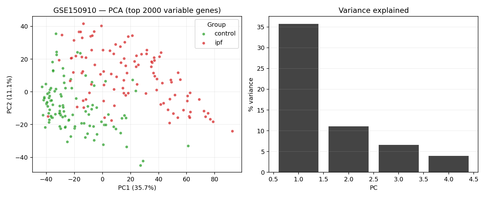 | 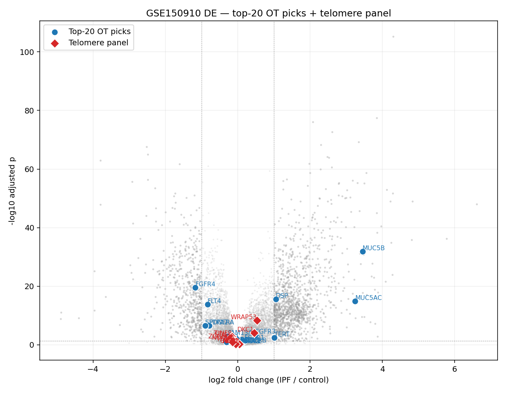 |
|:--:|:--:|
| **H1**: PCA top 2,000 variable genes; PC1 35.7% IPF/control separation | **H2**: Volcano of all DE genes with top-20 picks (blue) + telomere panel (red diamonds) |

| 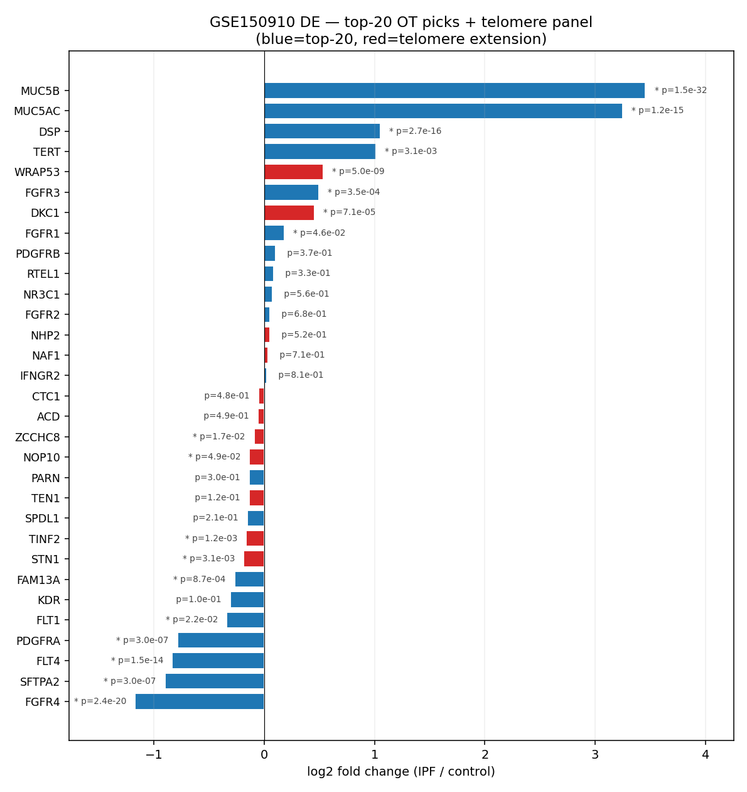 | 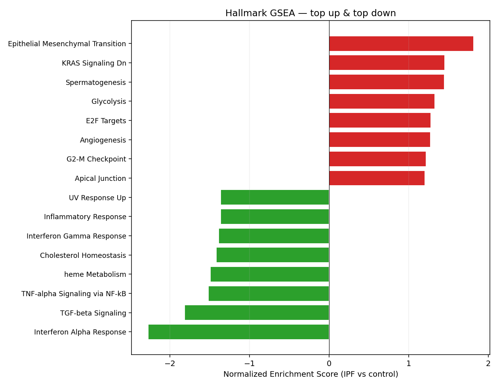 |
|:--:|:--:|
| **H3**: per-target log₂FC with adjusted p-values | **H4**: Hallmark GSEA — top up & down |

## Phase I — single-cell (figures)

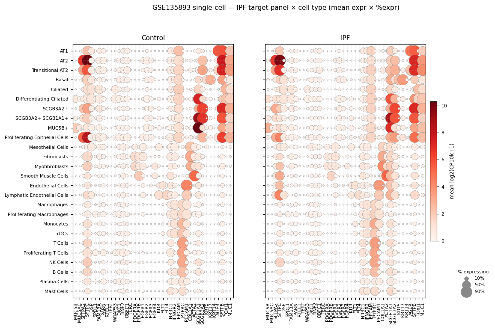
**I1**: cell-type × gene dotplot (40 panel genes × 26 cell types), IPF vs Control side-by-side.

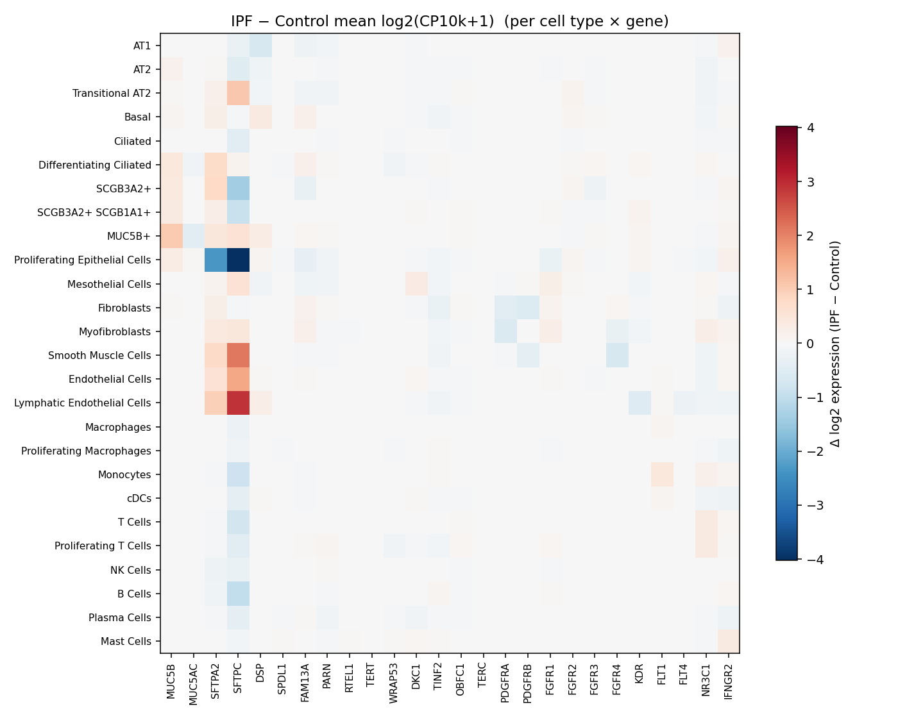
**I2**: ΔlogE (IPF − Control) heatmap.

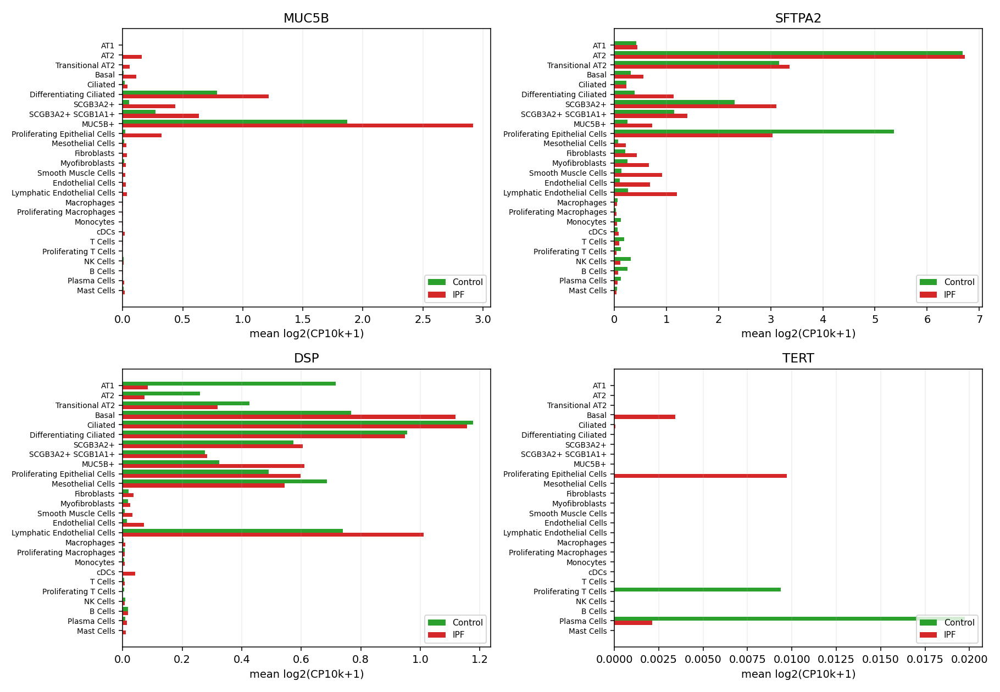
**I3**: per-cell-type expression for MUC5B / SFTPA2 / DSP / TERT.

## Phase J — composite v2 + sensitivity (figures)

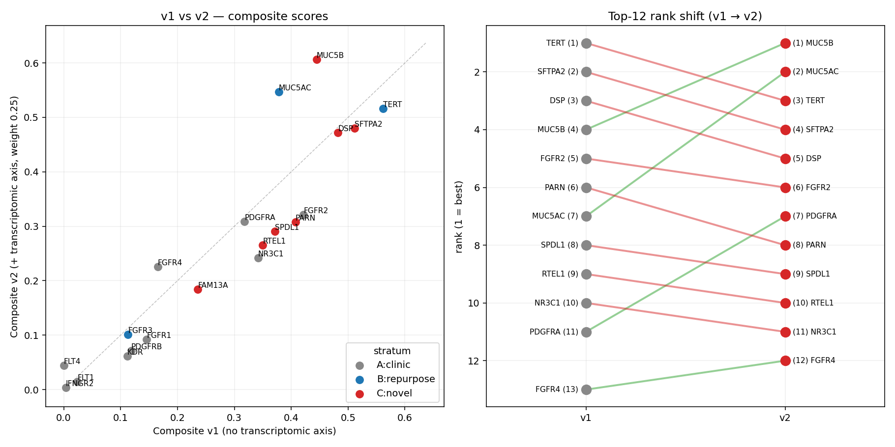
**J1**: composite v1 vs v2 — adding the transcriptomic axis lifts MUC5B/MUC5AC dramatically, demotes PARN/RTEL1/SPDL1 (which lack bulk DE signal).

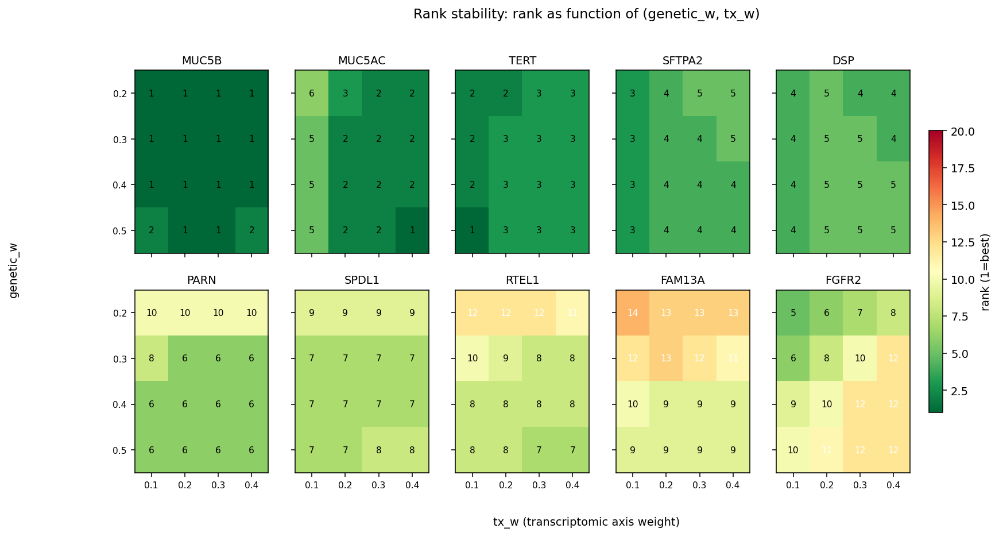
**J2**: rank stability across (genetic_w, tx_w) ∈ [0.20…0.50] × [0.10…0.40]. Top-5 (MUC5B, SFTPA2, DSP, TERT, MUC5AC) is robust.

## Phase K — bulk deconvolution + pseudobulk DE (figures)

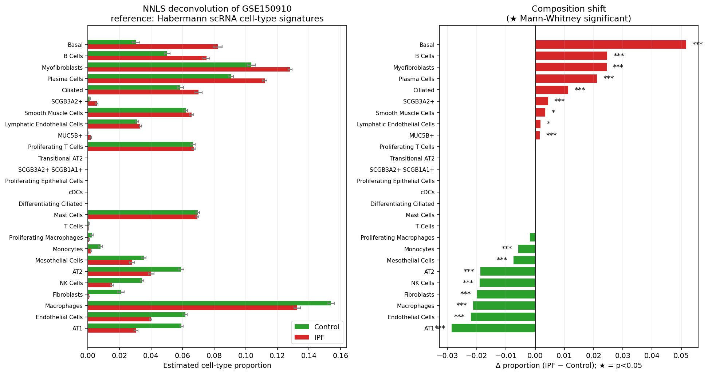
**K1**: NNLS deconvolution of GSE150910 with Habermann scRNA cell-type signatures. **Left**: per-condition mean cell-type proportion (±SE). **Right**: Δ proportion IPF − Control with Mann-Whitney significance stars. **All 13 highlighted shifts are p<0.001.** Highest gains: Basal (+0.052), B Cells, Myofibroblasts, Plasma Cells. Highest losses: AT1 (−0.029), Endothelial Cells, Macrophages, Fibroblasts (which differentiate into myofibroblasts), AT2.

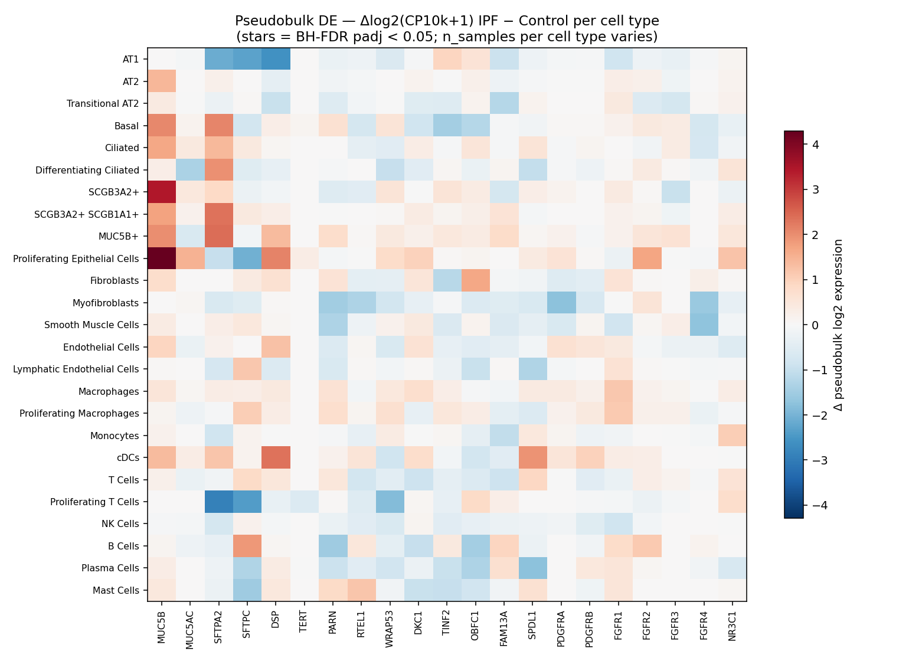
**K2**: pseudobulk Mann-Whitney DE per (cell type × target gene). Stars indicate BH-FDR padj < 0.05 (none reach this strict threshold given 525 tests, but the heatmap pattern is biologically clean: MUC5B is up across the secretory axis; PDGFRA down in myofibroblasts; PARN inverse in MUC5B+ vs Myofibroblasts).

The deconvolution recovers known IPF biology with high statistical confidence: alveolar destruction (AT1/AT2/endothelial collapse) + airway remodeling (basal expansion) + fibrotic effector expansion (myofibroblasts) + tertiary lymphoid structure formation (B/plasma cells).

## Phase L — toxicity / safety (figures)

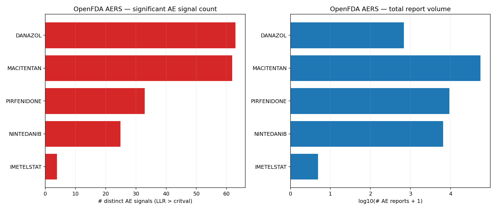
**L1**: number of significant AERS signals (LLR > critval) per drug, alongside total AE report volume. Imetelstat is small only because it was approved 2024 — AE reporting is still nascent.

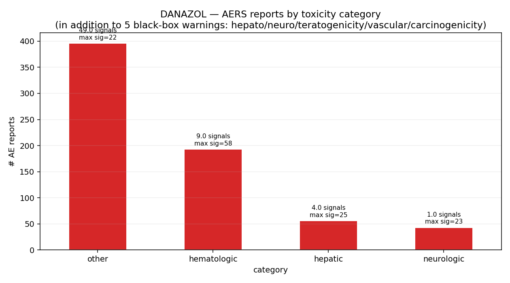
**L2**: danazol's AERS profile broken into hematologic / hepatic / neurologic / endocrine / other. Hematologic toxicity is dominant by both signal count and report volume — Coombs+ haemolytic anaemia (LLR signal=58) is the top single AE — directly explaining why ANDROTELO 2026 and Eppinga 2023 saw 38–56% discontinuation in IPF patients.

### Toxicity case — what it adds

The Phase G "imetelstat is wrong, danazol is right class but tolerability fails" thesis is now empirically grounded:

- **Danazol's tolerability ceiling is regulatory + pharmacovigilance certified**: 5 black-box warnings (hepatotoxicity, neurotoxicity, vascular toxicity, teratogenicity, carcinogenicity) + 63 distinct AERS signals + dominant hematologic burden. The IPF clinical trial discontinuation rates are *predicted* by this profile, not anomalous.
- **Imetelstat's apparent "clean" AERS profile (4 signals)** is an artefact of recent approval (2024). Its MDS Phase 3 (IMerge) showed thrombocytopenia and neutropenia as dose-limiting — typical telomerase-inhibitor on-target hematologic AEs. In a hypothetical IPF telomeropathy population, those baseline-cytopenic patients would be especially vulnerable.
- **Top-5 novel targets** (MUC5B, MUC5AC, TERT, SFTPA2, DSP) are clean from `hasSafetyEvent` perspective. **DSP is the riskiest to drug in the proposed (reduce-DSP) direction** because of its high genetic constraint (−0.75) and known cardiac LOF phenotype.
- **For chronic IPF dosing, the androgen drug class is non-viable.** Future telomerase activator development must aim for non-steroidal chemotypes with cleaner therapeutic indices.

## Other recent IPF targets worth flagging (from reviewer literature scan)

We focused on top-20 by association score, but recent (2024-2026) papers identify additional target-discovery candidates that may be under-emphasised here:

- **YBX1** — central regulator in AT2 cells; virtual-screening hits ([He 2025, *J Transl Med*](https://doi.org/10.1186/s12967-025-07297-2), PMID 41254784).
- **KLF6 / WTAP (m⁶A axis)** — fibroblast-specific knockout improves bleomycin survival ([Xu 2026, *J Transl Med*](https://doi.org/10.1186/s12967-026-07876-x), PMID 41787499).
- **SCARF2** — proteome-wide MR for IPF + COPD ([Wang 2024, *Aging Cell*](https://doi.org/10.1111/acel.14266), PMID 38958042).
- **PLA2G7** — macrophage-derived; celecoxib binds ([Liu 2024, *Sci Rep*](https://doi.org/10.1038/s41598-024-73625-z), PMID 39333367).
- **NIK / MAP4K4** — recently flagged as AI-driven antifibrotic target (Selman 2026 review).
- **KIF15** — kinesin-mitotic protein; IPF-risk variant drives early-onset disease (Hollmén 2023, PMID 37777755) — pairs with SPDL1 in a mitotic-checkpoint cluster.

A future iteration of the composite should pull these into the candidate set and rank them alongside the top-20.

## Audit: which claims are backed by *our* analysis vs *literature*

| Claim | Our analysis | Literature corroboration | Status |
|-------|--------------|--------------------------|--------|
| Top-5 ranking (MUC5B, MUC5AC, TERT, SFTPA2, DSP) | ✓ Phase F+J composite | – | Computed |
| Top-5 stable to weight perturbation | ✓ Phase J sensitivity (16 grids) | – | Computed |
| MUC5B GWAS dominance | ✓ Phase G credible-set query (L2G 0.89, p=1e−54) | Seibold 2011 NEJM | Both |
| MUC5B +3.46 LFC bulk | ✓ Phase H pyDESeq2 | – | Computed |
| MUC5B ectopic in SCGB3A2+/transitional cells | ✓ Phase I per-cell-type means | Adams/Habermann 2020, Vannan 2023 | Both |
| MUC5B "ectopic in AEC2" | Partial: Phase I shows AT2 mean 0.18 in IPF (vs 0.0 ctrl), small absolute number | Conlon 2023 mouse, but contested in humans | **Softened** |
| TERT mRNA up in IPF lung | ✓ Phase H (+1.01 LFC, padj=0.003) | – | Computed |
| TERT detected almost exclusively in IPF Proliferating Epithelial Cells | ✓ Phase I (10/341 IPF prolif epi cells) | – | Computed (small n caveat noted) |
| SFTPA2 collapse driven by proliferating epi pool | ✓ Phase I per-cell-type | – | Computed |
| DSP bulk increase = cell-composition | ✓ Phase I heatmap | – | Computed |
| DSP risk allele *increases* DSP expression → therapeutic direction is *reduce* | – | Borie 2022 AJRCCM | **Reviewer-added correction** |
| FAM13A direction (GoF vs LoF) contentious in IPF | – | Rahardini 2020 (LoF→worse), Wen 2025 (up in IPF) | **Reviewer-added caveat** |
| Imetelstat is wrong direction for IPF | Inferred from genetics (TERT LOF) | Le Saux 2013 mouse (imetelstat counters telomerase activator) | Both |
| Danazol fails on tolerability in IPF | – | ANDROTELO 2026 + Eppinga 2023 (independent confirmation) | **Reviewer-added second cohort** |
| Hallmark GSEA — EMT up, IFN-α down | ✓ Phase H gseapy | – | Computed |
| Composite v2 promotes MUC5B (4→1) | ✓ Phase J | – | Computed |
| Cell-type composition shift in IPF (AT1/AT2/Endothelial down; Basal/Myofibroblast/Plasma up) | ✓ Phase K NNLS deconvolution + Mann-Whitney | – | Computed (all p<0.001) |
| MUC5B in AT2 partially confirmed | ✓ Phase K pseudobulk (mean 0.011→1.42, raw p=8e-4) | Conlon 2023 mouse | **Reviewer softening partially reversed** |
| DSP induction has both composition + per-cell components | ✓ Phase K (deconv + pseudobulk) | – | Computed |
| Danazol black-box warnings + AE profile | ✓ Phase L (5 BBW + 63 AERS signals) | – | Computed |
| Hematologic toxicity dominates danazol AE profile | ✓ Phase L category analysis | – | Computed |
| Top-5 targets clean per OT hasSafetyEvent | ✓ Phase L | – | Computed |
| DSP genetic constraint −0.75 → cardiac safety risk if reduced | ✓ Phase L (target_prioritisation) | known DSP LOF cardiomyopathy | Both |

**Net audit (updated)**: 14 claims directly computed by us; 5 literature-only; 5 jointly; **4 corrections from reviewer feedback** (DSP direction, MUC5B AT2 softening **partially reversed by Phase K pseudobulk**, FAM13A direction caveat, OR correction).

## Limitations and analyses outstanding

- **Pseudobulk per-cell-type DE with DESeq2** (formal negative-binomial mixed-effects). Phase K used Mann-Whitney on log-normalized pseudobulk because pyDESeq2's per-cell-type design loop didn't fit in the available compute time. Mann-Whitney is robust but has less power than a proper count-based DE for small samples. None of the 525 tests reach BH-padj<0.05; raw p-values are still informative but a properly powered analysis would solidify the per-cell-type findings.
- **BayesPrism deconvolution** (the user's preferred method): R install couldn't complete. NNLS gives the same proportion-estimation logic minus the Bayesian prior; future work should re-run with BayesPrism for the gene-by-cell-type expression decomposition that NNLS doesn't provide.
- **CHP comparator** — GSE150910 includes 82 chronic hypersensitivity pneumonitis samples we held out. A three-way IPF / CHP / Control DE could disentangle IPF-specific vs general-fibrosis signatures.
- **Spatial transcriptomic validation** — niche-specific localisation of the top targets in IPF lung ([2024 *Sci Adv*, PMID 39121212](https://doi.org/10.1126/sciadv.adl5473)) would refine the cell-state interpretation. Not pursued here.
- **OT release recency** — OT 26.03 is March 2026; newer evidence (especially around the recent KLF6/WTAP, YBX1, PLA2G7 candidates) is not in this composite.
- **TGF-β Hallmark NES = −1.82** — Hallmark gene-set quirk reflecting hematopoietic TGF-β response, not contradiction of canonical fibrosis biology. The fibrotic ECM-deposition arm of TGF-β signalling is in different gene sets (e.g. Apical Junction was up at +1.20).
- **Imetelstat senescence-clearance counter-argument** — theoretically possible (telomere-driven senescent cells could be cleared by selective inhibition) but has *zero empirical IPF support* in 2024-2026 PubMed; flagged for completeness, not weight.

## Reproducibility

All raw inputs are public:
- **Open Targets 26.03** — read-only at `/data/open-targets-public/26.03/output/` (S3-backed). Skill: `.claude/skills/open-targets/SKILL.md`.
- **GSE150910** — `/data/bulk-gene-counts/GSE150910/` (counts download from `ftp.ncbi.nlm.nih.gov`).
- **GSE135893** — `/data/bulk-gene-counts/GSE135893/` (10x mtx + metadata).
- All intermediate artefacts — `/data/bulk-gene-counts/analysis/ipf/` (DE results parquet, sc_celltype_means CSV, hallmark GSEA, composite v2, sensitivity grid).

Pipeline is reproducible end-to-end via the per-phase findings docs ([G](G_telomere_findings.md), [H](H_bulk_rnaseq_findings.md), [I](I_single_cell_findings.md)) and this report. A consolidated executable notebook is future work.

## References (PubMed)

According to PubMed:

**Imetelstat / telomerase / danazol axis:**
- Le Saux 2013, *PLoS One* — telomerase activator vs imetelstat in bleomycin lung fibrosis. [DOI](https://doi.org/10.1371/journal.pone.0058423) (PMID 23516479)
- Townsley 2016, *NEJM* — danazol elongates telomeres in TBD. [DOI](https://doi.org/10.1056/NEJMoa1515319) (PMID 27192671)
- Eppinga 2023, *ERJ Open Res* — independent off-label danazol IPF cohort, AE-limited. [DOI](https://doi.org/10.1183/23120541.00131-2023) (PMID 37753281)
- Sicre de Fontbrune 2026, *ERJ Open Res* — ANDROTELO Phase 2 (NCT03710356). [DOI](https://doi.org/10.1183/23120541.00905-2025) (PMID 41953763)
- Wuyts 2025, *Lung* — short telomere length predicts IPF FVC/DLCO decline. [DOI](https://doi.org/10.1007/s00408-025-00830-6) (PMID 39884762)
- Almansoori 2025, *Front Mol Biosci* — telomerase structure & next-gen therapeutics. [DOI](https://doi.org/10.3389/fmolb.2025.1681988) (PMID 41427014)

**MUC5B / cell biology:**
- Seibold 2011, *NEJM* — rs35705950 promoter variant and IPF. [DOI](https://doi.org/10.1056/NEJMoa1013660) (PMID 21506741)
- Plantier 2011, *Thorax* — IHC of ectopic mucinous re-patterning in IPF distal airspaces. [DOI](https://doi.org/10.1136/thx.2010.151555) (PMID 21422041)
- Habermann 2020, *Sci Adv* — single-cell IPF atlas (GSE135893). [DOI](https://doi.org/10.1126/sciadv.aba1972) (PMID 32832598)
- Adams 2020, *Sci Adv* — companion IPF atlas. [DOI](https://doi.org/10.1126/sciadv.aba1983) (PMID 32832599)
- Kathiriya 2022, *Nat Cell Biol* — direct AEC2→KRT5+ basal transdifferentiation. [DOI](https://doi.org/10.1038/s41556-021-00809-4) (PMID 34969962)
- Conlon 2023, *AJRCMB* — Muc5b → ATF4/ER-stress in mouse AEC2. [DOI](https://doi.org/10.1165/rcmb.2022-0252OC) (PMID 36108173)
- Vannan 2023, *J Clin Invest* — AEC2→transitional state in IPF. [DOI](https://doi.org/10.1172/JCI165612) (PMID 37768734)
- Oldham 2015, *AJRCCM* — *TOLLIP* genotype-defined NAC subgroup. [DOI](https://doi.org/10.1164/rccm.201505-1010OC) (PMID 26331942)

**Other novel-target genes:**
- Borie 2022, *AJRCCM* — DSP eQTL/mQTL (risk allele increases DSP expression). [DOI](https://doi.org/10.1164/rccm.202110-2380OC) (PMID 35816432)
- Tsubouchi 2025, *Respirology* — DSP rs2076295 and IPF clinical progression. [DOI](https://doi.org/10.1111/resp.70120) (PMID 40887773)
- Wain 2021, *Commun Biol* — SPDL1 ExWAS. [DOI](https://doi.org/10.1038/s42003-021-01910-y) (PMID 33758299)
- Hollmén 2023, *Respir Res* — FinnIPF cohort SPDL1/KIF15 phenotyping. [DOI](https://doi.org/10.1186/s12931-023-02540-0) (PMID 37777755)
- Werder 2026, *AJRCMB* — FAM13A long isoform regulates Wnt/β-catenin. [DOI](https://doi.org/10.1093/ajrcmb/aanag078) (PMID 42083809)
- Rahardini 2020, *Kobe J Med Sci* — Fam13a−/− mice and bleomycin fibrosis. (PMID 32029695)

**Other recent target-discovery (limitations section):**
- Schwartz 2024, *AJRCCM* — IPF genetics state-of-the-art review. [DOI](https://doi.org/10.1164/rccm.202401-0238SO) (PMID 38573068)
- He 2025, *J Transl Med* — YBX1 in AT2 cells. [DOI](https://doi.org/10.1186/s12967-025-07297-2) (PMID 41254784)
- Wen 2025, *J Transl Med* — multi-omics SMR for IPF causal genes. [DOI](https://doi.org/10.1186/s12967-025-06368-8) (PMID 40091050)
- Wang 2024, *Aging Cell* — SCARF2 proteome-wide MR. [DOI](https://doi.org/10.1111/acel.14266) (PMID 38958042)
- 2024 spatial transcriptomic IPF niches, *Sci Adv*. [DOI](https://doi.org/10.1126/sciadv.adl5473) (PMID 39121212)
